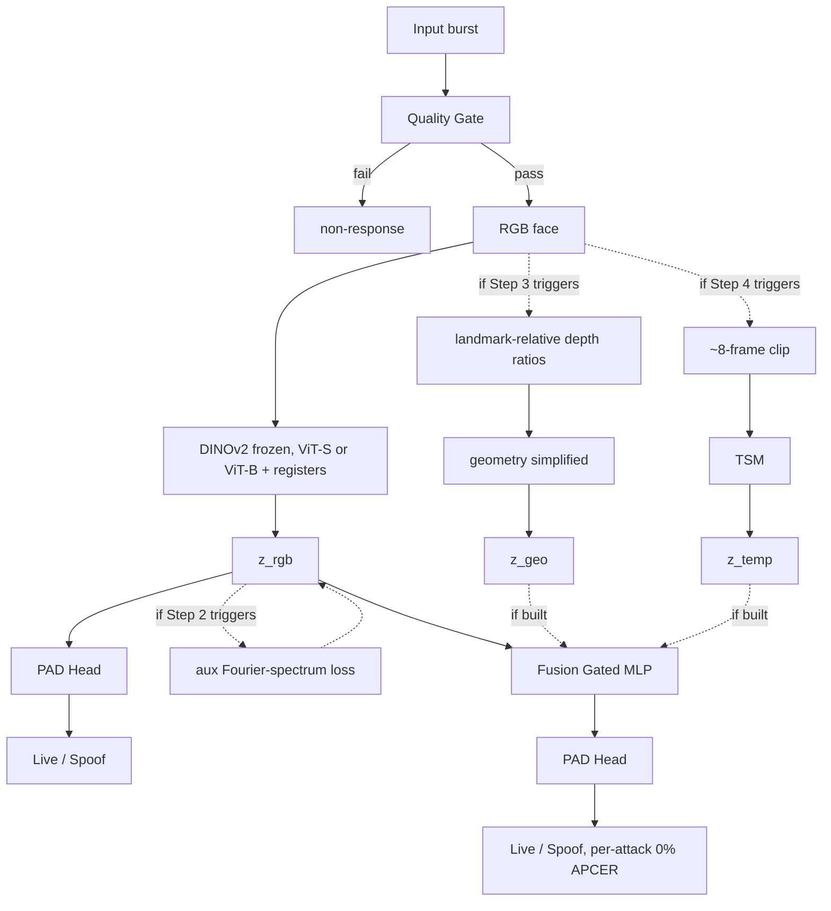
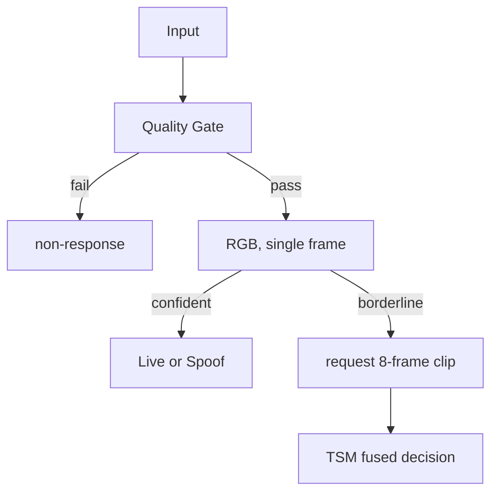

# Architecture Proposal

## Server-Side Passive Face Presentation Attack Detection

This proposal is for a server-side passive face Presentation Attack Detection (PAD) system. Phase 1 targets iBeta Level 1 conformance, with a path toward Level 2 and Level 3 later.

**The short version:** start with a frozen DINOv2 backbone on RGB. Then measure attack-specific error on the confirmed Level 1 attack set. Only add extra branches where that measurement shows a gap. The branch most likely to be needed first is frequency (as a supervision signal on the RGB branch, using a trick from a deployed anti-spoofing model). Geometry and temporal branches come last, and only if the numbers say so.

This is a stricter reading of the original research question: build the *smallest* architecture that keeps the cues we need, per phase, instead of assuming a full four-branch design and shrinking it later. I borrowed the frequency idea from an already-deployed FAS model rather than reinventing it.

---

## 1. Context

### 1.1 The problem

Build a passive PAD system for server-side deployment. Passive means the user does nothing deliberate; no blink, smile, or head-turn. The server looks at a captured face and decides live or spoof. Server-side means a GPU host with a low latency, memory, and compute budget.

The current target is Level 1. The Level 1 portfolio is:

- printed photos and simple paper masks (cutout, eyeholes, cylinder)
- low-resolution screen replay

These are produced by an attacker with no special skill, using ordinary equipment. iBeta allows a 0% attack acceptance rate at Level 1, so no attack in the test set may be accepted as genuine.

Level 3 is a later target. It adds high-fidelity masks, high-res replay, print-on-screen, and deepfake video. Those are deferred, not active.

### 1.2 Metrics

We score against APCER, BPCER, ACER, cross-device and cross-lighting generalization, unseen-attack generalization, model size, peak memory, inference latency, energy, and non-response rate (which must stay at or under 1%).

### 1.3 Scope

This covers physical presentation attacks visible in the captured image. Injection attacks, where a fake camera stream bypasses the sensor, are a separate problem and out of scope here. They matter only from Level 3 onward.

---

## 2. How the architecture builds up

Instead of committing to a fixed set of branches, the design is driven by measurements. Only the RGB baseline is committed up front. Everything else is built in this order, with a check between each step.

```
Step 1  RGB baseline with frozen DINOv2 (backbone size decided by a short ablation)
        -> measure attack-specific APCER on every Level 1 attack
        -> this decides which of the steps below are needed at all

Step 2  Frequency branch (preferred form: auxiliary supervision on the RGB branch)
        -> re-measure. Does print and replay APCER now clear the target?

Step 3  Decision gate: is cylinder-mask or eyeholes-mask APCER still too high?
        No  -> geometry is not built for Phase 1
        Yes -> build geometry (simplified landmark form, see Section 3)

Step 4  Decision gate: is replay motion still not strong enough?
        No  -> temporal is not built for Phase 1
        Yes -> build TSM, replay-motion role only (no deepfake in Level 1 data)
```

Every branch below is a candidate to build if its gate triggers, not a committed part of the Phase 1 system. A flash-reflection check is deliberately left out of Phase 1; it depends on unresolved questions about whether a flash is even eligible under Level 1 conformance, and it would need new capture data, so it is parked as a possible later-phase option (Section 7).

---

## 3. The architecture

### 3.1 Data flow



The only committed path is RGB to frozen DINOv2 to the PAD head. Everything else is added in order, only where the measurement in Section 2 shows a gap. A gated MLP fuses whichever branches survive.

### 3.2 Branches

| Branch | Status | Model | Pretrained | Notes |
| ------ | ------ | ----- | ---------- | ----- |
| RGB | committed | DINOv2 ViT-S or ViT-B + registers, frozen | yes | backbone size is a validation item |
| Frequency | Step 2 | auxiliary Fourier-supervision on the RGB branch; standalone DCT CNN is the fallback | small net from scratch | preferred form comes from a deployed FAS model |
| Geometry | Step 3, last | simplified landmark-relative depth ratios, not a full depth estimator | landmarks yes | carries the depth-hallucination caveat |
| Temporal | Step 4, last | TSM over the shared backbone, about 8 frames | reuses backbone | replay motion only at Level 1 |
| Fusion | committed | gated MLP over whichever branches survived | no | |

A note on the backbone size. Level 1 attacks are visually crude, so a smaller ViT-S may be enough at roughly a quarter of the compute of ViT-B. I want to measure that with a short ablation rather than assume it.

A note on the frequency branch. The standalone DCT/FFT branch from the original draft is fine, but a deployed anti-spoofing system (minivision-ai's Silent Face Anti-Spoofing) trains its main branch with an auxiliary Fourier-spectrum supervision loss instead. That avoids a whole separate branch and the fusion tuning that comes with it. I plan to try that form first and only fall back to a standalone branch if it underperforms.

A note on geometry and the depth problem. A monocular depth estimator does not measure depth. It predicts a plausible shape from a single image. A very high-quality flat print will produce a depth map that looks like a face, because the model is interpreting the picture as if it were a face. So depth is not reliable against flat high-quality prints, which is one reason it is not a committed branch and is kept in a simplified form if built at all.

### 3.3 How the client and server talk

Transport is part of the latency story, often more than the model itself.

- Default path: the client captures a short burst, picks the sharpest frame on-device, and uploads only that single frame.
- Temporal path (if Step 4 triggers): a short clip of about 8 frames, and only when the cascade asks for it.

The liveness decision itself stays server-side. Client logic is limited to capture quality and frame selection.

---

## 4. Training

### 4.1 Loss

```
L = L_class + aux branch losses + freq spectrum loss + fusion loss
```

The frequency-spectrum term only appears if the frequency branch is built in its auxiliary-supervision form, in which case it replaces a separate frequency branch loss.

Auxiliary per-branch losses matter the most. Each branch must classify live or spoof on its own, on top of the fused loss. Without this, the dominant RGB branch takes over the gradient and the weaker branches become dead weight that the fusion learns to ignore.

### 4.2 Data

Primary source is the Axonlab iBeta Level 1 dataset on Kaggle. It is video-only, about 10 second clips, with 30,000+ samples. It has no deepfake or silicone content, which is fine for Level 1. The attack classes are print plus cutout, eyeholes mask, cylinder paper mask, paper mask on actor, basic 3D paper mask, and PC and mobile replay.

The dataset includes an active-zoom phase. This system is passive-only, so the model must not learn to key on zoom motion as a liveness cue.

Public datasets such as CASIA-SURF, OULU-NPU, CelebA-Spoof, and Replay-Attack can carry most of the frequency and basic RGB signal. Splits are subject-wise so no identity crosses splits, and stratified by attack type and by dataset source when merging.

---

## 5. Success criteria

| Criterion | Expected | Notes |
| --------- | -------- | ----- |
| Overall and attack-specific APCER | strong | depends on which gates fire, measured per Section 2 |
| ACER | strong | report per attack type, not just aggregate |
| Cross-device generalization | risk | frequency signal varies by device |
| Unseen-attack generalization | open | measure on held-out attacks |
| Non-response rate | at or under 1% | gated by the quality gate |

The main risk is domain gap. A spoof's frequency signature mixes with device, ISP, and compression noise. A branch trained mostly on public data can learn that dataset's fingerprint rather than the deployment's. The fix is to calibrate on the target camera pipeline.

---

## 6. Inference cascade



The single-frame RGB path handles most inputs and keeps latency low. Borderline cases request a short clip and engage the temporal branch if it is built.

---

## 7. Open questions

These are the things to settle before building out more of the architecture.

1. Backbone size, ViT-S versus ViT-B, tested on attack-specific APCER. About half a day.
2. Frequency form: auxiliary supervision versus a standalone branch. The auxiliary form first, per the deployed-model evidence.
3. Geometry gate: does frequency alone already handle the cylinder mask through paper texture, regardless of curvature? If so, geometry is not needed for Phase 1.
4. Temporal gate: does replay APCER clear the target without TSM once frequency is in? If so, temporal is not needed for Phase 1.
5. L2 and L3 dataset acquisition. A later-phase item, not a Phase 1 blocker.

A flash-reflection check is parked as a possible later-phase option rather than a Phase 1 branch. It could help against print and replay, but it depends on whether an app-emitted flash is even eligible under the conformance methodology, and it would need new capture data that does not exist yet. Neither question is worth resolving before the RGB and frequency results come in, so it is set aside for now.

---

## 8. Why not the other options

The alternatives were evaluated when choosing this direction.

- A, RGB only with DINOv2. Too thin on its own. It under-serves replay moire and print texture, which is where frequency and temporal cues carry the load. Good as a baseline, not as the whole system.
- C, independent cue specialists. Four heavy models duplicate compute and memory and break the low-latency constraint.
- D, region-based mixture of experts. Adds routing complexity with no clear win over this design for these attacks.
- E, video-first transformer. Too data- and compute-hungry, against the low-resource constraint.
- F, large ensemble. Best theoretical robustness but the worst cost and maintenance.

---

## References

1. iBeta ISO/IEC 30107-3 PAD test methodology and confirmation letters. https://www.ibeta.com/iso-30107-3-presentation-attack-detection-confirmation-letters/
2. Oquab, M. et al., DINOv2, arXiv:2304.07193
3. Darcet, T. et al., Vision Transformers Need Registers, ICLR 2024, arXiv:2309.16588
4. Lin, J., Gan, C., Han, S., TSM, IEEE TPAMI 2019, arXiv:1811.08383
5. minivision-ai, Silent-Face-Anti-Spoofing. https://github.com/minivision-ai/Silent-Face-Anti-Spoofing
6. Axonlab AI, iBeta Level 1 Paper & Replay Attacks Dataset, Kaggle. https://www.kaggle.com/datasets/axondata/ibeta-level-1-paper-attacks
